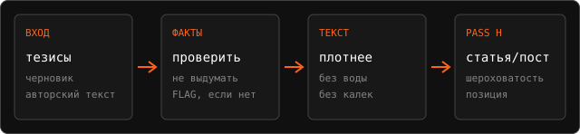
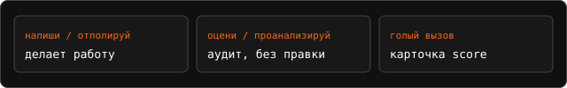

<p align="center">
  
</p>

<p align="center">
  <a href="LICENSE"></a>
  <a href="https://github.com/letya999/prose-polish-ru/releases/tag/v0.1.0"></a>
  <a href="https://github.com/letya999/prose-polish-ru/stargazers"></a>
  <a href="https://github.com/letya999/prose-polish-ru/commits/main"></a>
  <a href="https://github.com/letya999/prose-polish-ru/actions/workflows/check.yml"></a>
  
  
  
  <a href="https://skills.sh/letya999/prose-polish-ru/prose-polish-ru"></a>
</p>

Редакционный скилл и жёсткий хуманизатор для русского текста. Вход —
тезисы, сгенерированный черновик или готовый авторский текст. Число из
черновика — не факт, пока его не проверили. На статье и посте обязателен
Pass H: авторский стиль, лёгкие опечатки, шероховатость, косноязычие,
эмоциональность и категоричность.

Контракт: [`SKILL.md`](SKILL.md). Процедура:
[`references/editorial-procedure.md`](references/editorial-procedure.md).
Каталог маркеров:
[`references/ai-markers.md`](references/ai-markers.md).

## Quick start

```bash
npx skills add letya999/prose-polish-ru -g -y --skill prose-polish-ru --copy -a "*"
```

В агенте вызови скилл по имени и вставь тезисы или черновик:

```text
$prose-polish-ru отполируй этот пост:

[текст]
```

Без глагола скилл отдаст карточку `score` и меню, правку не начнёт.
Обычное «перепиши» без имени скилла его не включает.

Локальная копия из клона:

```bash
git clone https://github.com/letya999/prose-polish-ru.git
cd prose-polish-ru
npx skills add . -g -y --skill prose-polish-ru --copy -a "*"
python scripts/lint_text.py --self-test
```

## Один конвейер, четыре шага

<p align="center">
  
</p>

Точность раньше пользы, польза раньше структуры, структура раньше голоса.
Плотное предложение, которое увереннее свидетельства, — провал. P(нейрослоп)
оценивает наполнение, не «писала ли модель». Процент GPTZero без скана не
выдумывается.

## Маршрут по просьбе, не по счётчику сессии

<p align="center">
  
</p>

Глубина (`light` · `standard` · `deep`) и формат выдачи (`clean` · таблица ·
`audit` · `score`) — разные оси. `clean` — формат без таблицы маркеров, не
отключение фактчека.

## Русские хуманизаторы

Все открытые русские хуманизаторы, которые имеют смысл как сосед по задаче:
скилл, линтер или офлайн-библиотека именно для русского AI-текста. Не
.NET Humanizer и не англоязычный dump Wikipedia:Signs of AI writing.
Звёзды — снимок на 2026-09-05.

| Репозиторий | ★ | Что это |
|---|---:|---|
| [ilyautov/humanizer-ru](https://github.com/ilyautov/humanizer-ru) | 286 | 64 признака, 20 банов, калибровка под голос, eval до/после. Метит в GPTZero / burstiness |
| [smixs/humanizer-ru](https://github.com/smixs/humanizer-ru) | 148 | 38 паттернов, detect без правки, питоновский линтер жёстких запретов |
| [N1arko/redaktura-skills](https://github.com/N1arko/redaktura-skills) | 130 | Набор редакторских скиллов (главред, посты, UX-копирайт), не только хуманизатор |
| [Vladimir-Human/humanizer-ru](https://github.com/Vladimir-Human/humanizer-ru) | 123 | Сначала находит следы и объясняет. 40 regex, реестр доказательств, демо в браузере |
| [ksanyok/TextHumanize](https://github.com/ksanyok/TextHumanize) | 75 | Офлайн-библиотека, 25 языков включая русский. Не агентский скилл |
| [thevseprod/humanizer-ru](https://github.com/thevseprod/humanizer-ru) | 37 | Компактный скилл: отдельные правила RU и EN в одном `SKILL.md` |
| [gc-tilda/pishi-chelovechno](https://github.com/gc-tilda/pishi-chelovechno) | 8 | 31 запрет трёх уровней вместо советов «пиши живо» |
| [asavvin-pixel/ochelovech](https://github.com/asavvin-pixel/ochelovech) | 1 | Типографика, лексика, структура; калибровка под автора |

Этот скилл стоит рядом, не вместо них. Соседи в основном охотятся за
маркерами и обходом детектора. Здесь ещё обязательны проверка утверждений,
KEEP защищённых спанов и Pass H: лёгкая небрежность и позиция на статье/посте,
а не идеально вычесанный «человеческий» шаблон.

На одной статье мы сравнивали
[stop-slop](https://github.com/hardikpandya/stop-slop),
[blader/humanizer](https://github.com/blader/humanizer),
[ilyautov](https://github.com/ilyautov/humanizer-ru),
[smixs](https://github.com/smixs/humanizer-ru) и
[Vladimir-Human](https://github.com/Vladimir-Human/humanizer-ru).
Английские скиллы не закрывают канцелярит и русские кальки.
`humanizerai/humanize` без ключа API не стартует.

## Английские, от 200 звёзд

Только репозитории, где задача — очеловечить или снять AI-следы с прозы.
Не .NET Humanizer, не SharePoint, не «taste» и не дизайн-hallmark.
Китайские форки blader (`op7418/Humanizer-zh`, ~17k) сюда не входят.
Звёзды — снимок на 2026-09-05.

| Репозиторий | ★ | Зачем смотреть |
|---|---:|---|
| [blader/humanizer](https://github.com/blader/humanizer) | 43065 | Канонический агентский скилл. 35 паттернов Wikipedia:Signs of AI writing |
| [hardikpandya/stop-slop](https://github.com/hardikpandya/stop-slop) | 16823 | Бан-листы фраз и структур. Крупный, давно без коммитов |
| [conorbronsdon/avoid-ai-writing](https://github.com/conorbronsdon/avoid-ai-writing) | 4113 | Detect-only и плотность флагов. Живая поддержка |
| [lynote-ai/humanize-text](https://github.com/lynote-ai/humanize-text) | 1600 | Пайплайн: translation chain, multi-turn rewrite, detection loop |
| [fromleda/text-humanizer](https://github.com/fromleda/text-humanizer) | 739 | Обход GPTZero / Turnitin, не редактор |
| [DadaNanjesha/AI-Text-Humanizer-App](https://github.com/DadaNanjesha/AI-Text-Humanizer-App) | 421 | Streamlit, spaCy + NLTK, без LLM |
| [harshaneel/humanize](https://github.com/harshaneel/humanize) | 415 | Два статических скилла, опора на литературу 2024–2026 |
| [Anbeeld/WRITING.md](https://github.com/Anbeeld/WRITING.md) | 363 | Правила под жанр, якоря, самоаудит |
| [sam-paech/antislop-sampler](https://github.com/sam-paech/antislop-sampler) | 355 | Подавление слопа на инференсе, не пост-редактура |
| [devswha/patina](https://github.com/devswha/patina) | 345 | KO / EN / ZH / JA |
| [lynote-ai/humanize-text-skill](https://github.com/lynote-ai/humanize-text-skill) | 236 | Скилл-обёртка того же пайплайна |
| [Aboudjem/humanizer-skill](https://github.com/Aboudjem/humanizer-skill) | 214 | 55 паттернов, 5 голосов, оценка 0–100, локально |

Ниже порога, но из того же сравнения: [jpeggdev/humanize-writing](https://github.com/jpeggdev/humanize-writing) (58),
[humanizerai/agent-skills](https://github.com/humanizerai/agent-skills) (42, нужен API-ключ).

<details>
<summary>Датасеты, по которым тюнился каталог</summary>

Корпуса — источники *классов* слопа (gazetteer-padding, abstract-mold, span
KEEP), не обучающая выборка для классификатора. Не гонять по ним detector
score.

### Русский (приоритет)

| Корпус | Что внутри | Зачем скиллу |
|---|---|---|
| [iitolstykh/LLMTrace_classification](https://huggingface.co/datasets/iitolstykh/LLMTrace_classification) | ~340k RU + ~249k EN, human/AI, 8–9 доменов, GPT-4o, GigaChat, YaGPT, Qwen, Gemini | Живой RU-слоп: wiki-continue, expand-news, отзывы. Бумага: [arXiv:2509.21269](https://arxiv.org/abs/2509.21269) |
| [iitolstykh/LLMTrace_detection](https://huggingface.co/datasets/iitolstykh/LLMTrace_detection) | human / ai / mixed + `ai_char_intervals` | Смешанный черновик: KEEP полезный факт, не «человеческий интервал». Авторство ≠ качество |
| [iis-research-team/AINL-Eval-2025](https://huggingface.co/datasets/iis-research-team/AINL-Eval-2025) · [GitHub](https://github.com/iis-research-team/AINL-Eval-2025) | 52k русских научных тезисов | Шаблон аннотации: `оказывает существенное влияние`, мало цифр. [arXiv:2508.09622](https://arxiv.org/abs/2508.09622) |
| [RussianNLP/coat](https://huggingface.co/datasets/RussianNLP/coat) · [GitHub](https://github.com/RussianNLP/CoAT) | 246k RU, 13 генераторов, 6 доменов | Жанровый сдвиг: парафраз / суммаризация / упрощение vs человек |
| [CoffeBank/Ru-hard-detection-dataset](https://github.com/CoffeBank/Ru-hard-detection-dataset) | Новости, эссе, наука; human / ai / ai+rew | Парафраз-слой: слоп после «перепиши» |
| [GigaCheck](https://github.com/ai-forever/gigacheck) | Код + модели на LLMTrace; span localization | Не корпус текстов. [arXiv:2410.23728](https://arxiv.org/abs/2410.23728) |

Страница LLMTrace: https://sweetdream779.github.io/LLMTrace-info/

### Английский (классы, не токены)

| Корпус | Что внутри | Зачем скиллу |
|---|---|---|
| [Shaib et al. slop](https://github.com/cshaib/slop) | Span-разметка Density / Templatedness / Factuality / Tone | Слоп = качество спана, не «кто писал». [arXiv:2509.19163](https://arxiv.org/abs/2509.19163) |
| [unslop-ai-text](https://github.com/JCarterJohnson/vibecoded-design-tells/tree/main/unslop-ai-text) | Reddit 2021–2026, 600 постов hand-audit | Что люди *цитируют* как tell. Keyword-pass врёт |
| [sam-paech/antislop-sampler](https://github.com/sam-paech/antislop-sampler) | `slop_phrases_*.json`, regex `not just X but Y` | EN fiction/blog fingerprints; в RU смотреть кальку |
| [antislop FTPO preference](https://huggingface.co/datasets/sam-paech/gemma-3-27b-it-antislop-ftpo-preference-dataset) | Preference-пары, поле `slop_phrase` | Размеченный нейрослоп на уровне фразы |
| [N8Programs/unslop-good](https://huggingface.co/datasets/N8Programs/unslop-good) | 1k EN «polish this AI passage» | Purple travel/marketing fill |
| [WriteHuman 2026 tells](https://writehuman.ai/blog/ai-tells-in-2026) | 80k humanization pairs | Измеренные EN-формы 2026 |

Не учебный слоп-корпус: [Solenopsisbot/real-slop](https://huggingface.co/datasets/Solenopsisbot/real-slop) (сырые чаты, NSFW, без разметки слопа); бинарные super-corpus human/AI без span-слопа.

</details>

<details>
<summary>Как тюнить целиком, не только SKILL.md</summary>

Каталоги — часть скилла. Eval, который пихает в system только `SKILL.md`,
не проверяет, узнаёт ли модель классы из `ai-markers.md`. Честный цикл
грузит те же файлы, что скилл велел бы загрузить, и правит *владеющий* файл.

1. Заморозить срез постов/статей (article, story, short_form, factual;
   квоты по типу, без wiki-continue/gazetteer; 8 постов канала как house):
   `python scripts/corpus_eval.py sample --seed 51 --force`
   Сто постов канала: `python scripts/corpus_eval.py sample --house-only --n 100 --force`
2. Прогнать пакет, не карту:

```powershell
python scripts/corpus_eval.py run --pack audit
# ablation:  --pack map
# heuristics+formats тоже:  --pack full
```

3. `python scripts/corpus_eval.py grade` — спаны против золота **и** какие
   `§N` модель процитировала, плюс линт на том же тексте.
4. Читать `disagreements.md`: у каждого MISS/FP есть `route →` файл.
   Не больше трёх атомарных правок за круг, **по одному файлу**:

| Куда | Когда |
|---|---|
| `SKILL.md` | сломались depth / invocation / output contract / progressive disclosure |
| `references/editorial-procedure.md` | KEEP/TRIM treatment, таблица Pass 3, точность выше голоса |
| `references/ai-markers.md` | новый *класс* или False slop; не запрещённое слово |
| `references/heuristics.md` | аргумент, ритм, дикция, голос |
| `references/formats-and-artifacts.md` | Markdown, таблицы, списки, ссылки, код |
| `scripts/lint_text.py` | regex-стабильный fill + простой язык `Y01`–`Y08` + подписи `F42` |
| `scripts/check_readability.py` | before/after скан: карточки, заголовки, таблицы, рубленые удары, длинные фразы. Не Флеш |
| `assets/simple-language.md` | ремесло простого языка: одна мысль, первое предложение работает. Не «ясный язык» |

5. Если линт уже видит класс, а модель KEEP — сначала смотреть, не
   ложный ли это вызов линтера. Иначе miss узнавания, а не дыра в каталоге.
6. Тот же срез после патча. Held-out — отдельный замороженный срез, не
   «тот же sample с новым seed». Recall/precision по `ai_char_intervals` —
   диагностика авторского перекрытия, не оценка качества правки.

Линтер отдельно: `python scripts/lint_text.py --self-test`. Отсутствие
`§N` в ответе — проблема формата отчёта, не доказательство, что правило
не применили.

</details>

<details>
<summary>Прогон скилла по датасету</summary>

Модель и прокси задаются переменными `PROSE_POLISH_MODEL`,
`PROSE_POLISH_LITELLM_CONTAINER`, `PROSE_POLISH_CLIPROXY_URL`
(по умолчанию Gemini через cliproxy в контейнере `ai-stp-litellm-1`).
Золото `ai_char_intervals` — *авторство*, не слоп и не качество правки.
Хороший ИИ-фрагмент, оставленный KEEP, не обязан быть FN.

Три группы проверки (авторство — только диагностика):

1. **Контрольные искажения** — `check_preservation.py --self-test`,
   `check_readability.py --self-test`, `lint_text.py --self-test`.
2. **Полный редакторский прогон** — `corpus_eval.py run --mode polish`.
   Нужна отдельная редакторская разметка (`editorial_spans`).
3. **Слепое сравнение** — исходник / обычная генерация / скилл; люди из
   аудитории. «Неотличим от человека» так и проверяется, не одним процентом.

Рабочие критерии приёмки: существенные факты проверены или ограничены;
не добавлены новые неподтверждённые обещания; читатель понимает тезис и
находит действие; голос узнаваем, на статье/посте есть шероховатость и
позиция, без выдуманного опыта.

```powershell
python scripts/corpus_eval.py sample
python scripts/corpus_eval.py run --pack audit
python scripts/corpus_eval.py grade
```

Пилот на 2 текстах: `python scripts/corpus_eval.py run --pack audit --limit 2`

`--pack`: `map` (только SKILL.md) · `audit` (карта + procedure + ai-markers,
default) · `full` (ещё heuristics и formats) · `auto` (audit + formats, если
в черновике Markdown).

| Файл | Что внутри |
|---|---|
| `slice.jsonl` | 80 постов/статей: 40 LLMTrace_detection + 32 classification + 8 house-постов. House не входит в recall/precision |
| `pack-manifest.json` | какие файлы уехали в system prompt |
| `runs/<id>/audit.md` | ответ модели |
| `runs/<id>/spans.json` | KEEP/TRIM/REWRITE/DELETE/FLAG + offsets |
| `span-agreement.json` | recall/precision по символам + cited `§N` |
| `catalog-usage.json` | какие секции каталога модель назвала |
| `disagreements.md` | MISS/FP + `route →` файл |

Как читать `disagreements.md`:

- **MISS** — золото сказало «тут AI», скилл оставил KEEP.
- **FP** — золото сказало «человек», скилл пометил слоп.
- **Catalog usage** — доля ответов с `§N`. Ноль при `--pack audit` значит, что цитирование классов не работает.
- Не поднимать precision, сваливая KEEP-примеры в `SKILL.md`.

Пропуск готового `spans.json` срабатывает только если совпал fingerprint
текста, пакета, промпта и модели. `run` возвращает 0 только если все кейсы
ок; частичный прогон — код 1.

`assets/simple-language.md` и `agents/openai.yaml` входят в пакет.

</details>

<details>
<summary>Документация</summary>

- [SKILL.md](SKILL.md) — контракт скилла
- [CONTRIBUTING.md](CONTRIBUTING.md) — куда патчить и какие проверки гонять
- [SECURITY.md](SECURITY.md) — как сообщить об уязвимости
- [AGENTS.md](AGENTS.md) — правила для агентов
- [CHANGELOG.md](CHANGELOG.md) — релизы
- [CODE_OF_CONDUCT.md](CODE_OF_CONDUCT.md)

</details>

<details>
<summary>License</summary>

MIT. Copyright (c) 2026 Artem Letyushev. See [LICENSE](LICENSE).

</details>

